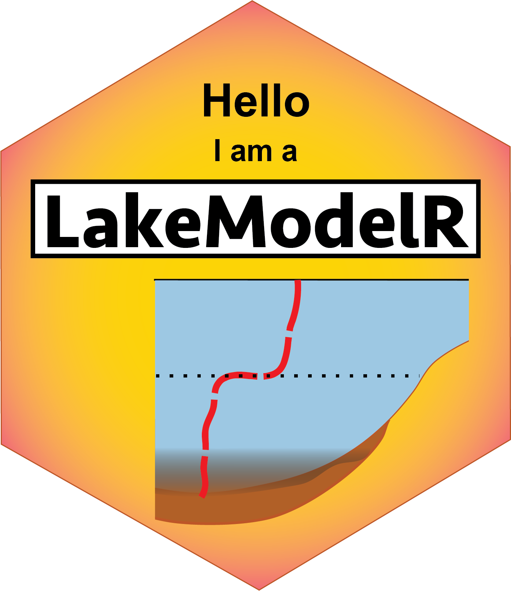

# LakeModelR
<a href="url"></a>

-----

:busts_in_silhouette: Robert Ladwig, Cal Buelo, Ellen Albright, Paul Hanson
:email: [contact](mailto:ladwigjena@gmail.com)
:computer: [more info](https://robertladwig.github.io)

-----

LakeModelR is a R package to run a modularized 1D integral energy model for water temperature dynamics in a lake. The mixing algorithms are based on the MINLAKE (Ford and Stefan 1980, Riley and Stefan 1988, Herb and Stefan 2004) and the MyLake (Saloranta and Andersen 2007) models. Implementations to estimate the incoming and outgoing long-wave heat fluxes were taken from Livingstone and Imboden (1989) and Goudsmit et al. (2002). The latent and sensible heat fluxes were calculated taking into account atmospheric stability using the algorithms by Verburg and Antenucci (2010). The ice algorithms from MyLake (Saloranta and Andersen 2007) were applied to simulate ice formation and melting. Click [here](https://github.com/robertladwig/LakeModeling/blob/main/Manual/1D_IntegralEnergy.pdf) for an overview of the model algorithm.

The package can be installed through

```{r gh-installation, eval = FALSE}
#install.packages("remotes")
require(remotes)
remotes::install_github("robertladwig/LakeModelR")
```

To test the model code run either example.R or

```{r gh-run, eval = FALSE}
#' Example workflow to run the 1D integral energy model
#' Long-term Mendota data were obtained from North Temperate Lakes Long Term
#' Ecological Research program (#DEB-1440297)
#' @author: Robert Ladwig
#' @email: ladwigjena@gmail.com

## CLEAN WORKSPACE
rm(list = ls())

## INSTALL PACKAGE
# install.packages("remotes")
# require(remotes)
# remotes::install_github("robertladwig/LakeModelR")

## LOAD PACKAGE(S)
library(LakeModelR)
require(tidyverse)

## GENERAL LAKE CONFIGURATION
zmax = 25 # maximum lake depth
nx = 25 # number of layers we want to have
dt = 3600  # temporal step (here, one hour because it fits boundary data)
dx = zmax/nx # spatial step

## HYPSOGRAPHY OF THE LAKE
hyps_all <- get_hypsography(hypsofile = system.file('extdata', 'bathymetry.csv',
                            package = 'LakeModelR'),
                            dx = dx, nx = nx)

## ATMOSPHERIC BOUNDARY CONDITIONS
meteo_all <- provide_meteorology(meteofile = system.file('extdata', 'meteorology.csv',
                            package = 'LakeModelR'),
                            secchifile = NULL)

### TIME INFORMATION
startingDate <- meteo_all[[1]]$datetime[1]
startTime = 1
endTime = 365 *24 * 3600 # seconds
total_runtime = endTime / 24 / 3600 # days

# INTERPOLATE ATMOSPHERIC BOUNDARY CONDITIONS
meteo = get_interp_drivers(meteo_all = meteo_all,
                           total_runtime = total_runtime,
                           dt = dt,
                           method = "integrate",
                           secchi = F)

## DEFINE INITIAL WATER TEMPERATURE FROM OBSERVED DATA
u_ini <- initial_profile(initfile = system.file('extdata', 'observedTemp.txt',
                            package = 'LakeModelR'),
                            nx = nx, dx = dx,
                            depth = hyps_all[[2]],
                            processed_meteo = meteo_all[[1]])

## RUN THE LAKE MODEL
res <-  run_thermalmodel(u = u_ini,
                          startTime = startTime,
                          endTime =  endTime,
                          ice = FALSE,
                          Hi = 0,
                          iceT = 6,
                          supercooled = 0,
                          kd_light = 0.5,
                          sw_factor = 1.0,
                          zmax = zmax,
                          nx = nx,
                          dt = dt,
                          dx = dx,
                          area = hyps_all[[1]], # area
                          depth = hyps_all[[2]], # depth
                          volume = hyps_all[[3]], # volume
                          daily_meteo = meteo,
                          Cd = 0.0013,
                          scheme = 'implicit')

## SAVE THE RESULTS
temp = res$temp
mixing = res$mixing
ice = res$icethickness
avgtemp = res$average

## POST-PROCESSING OF THE RESULTS
time =  startingDate + seq(1, ncol(temp), 1) * dt
avgtemp = as.data.frame(avgtemp)
colnames(avgtemp) = c('time', 'epi', 'hyp', 'tot', 'stratFlag', 'thermoclineDep')
avgtemp$time = time

## AVERAGE TEMPERATURES IN EPILIMNION AND HYPOLIMNION
ggplot(avgtemp) +
  geom_line(aes(time, epi, col = 'epilimnion')) +
  geom_line(aes(time, hyp, col = 'hypolimnion')) +
  geom_line(aes(time, tot, col = 'total')) +
  theme_minimal()

## CREATE DATAFRAME FOR FULL TEMPERATURE PROFILES
df <- data.frame(cbind(time, t(temp)) )
colnames(df) <- c("time", as.character(paste0(seq(1,nrow(temp)))))
m.df <- reshape2::melt(df, "time")
m.df$time <- time

## CREATE DATAFRAME FOR ICE
df.ice = data.frame('time' = time,
                    'ice_h' = ice)

## HEATMAP OF WATER TEMPERATURE WITH THERMOCLINE DEPTH AND ICE THICKNESS
ggplot(m.df, aes((time), dx*as.numeric(as.character(variable)))) +
  geom_raster(aes(fill = as.numeric(value)), interpolate = TRUE) +
  scale_fill_gradientn(limits = c(-1,30),
                       colours = rev(RColorBrewer::brewer.pal(11, 'Spectral')))+
  theme_minimal()  +xlab('Time') +
  ylab('Depth [m]') +
  labs(fill = 'Temp [degC]')+
  geom_line(data = avgtemp, aes(time, thermoclineDep, col = 'thermocline depth'), linetype = 'dashed', col = 'brown') +
  geom_line(data = df.ice, aes(time, ice_h * (-1), col = 'ice thickness'), linetype = 'solid', col = 'darkblue') +
  scale_y_reverse()

```

References:

Ford, D.E., and H.G. Stefan. 1980. Thermal predictions using an integral energy model. J. Hydraul. Div. ASCE 106(1). 39-55

Goudsmit, G.H., H. Burchard, F. Peeters, and A. Wüst. 2002. Application of k-e turbulence models to enclosed basins: The role of internal seiches. Journal of Geophysical Research 107. C12. 3230. doi:10.1029/2001JC000954

Herb, W.R., and H.G. Stefan. 2004. Temperature Stratification and Mixing Dynamics in a Shallow Lake With Submersed Macrophytes. Lake and Reservoir Management 20. 4. 296-308. doi:10.1080/07438140409354159

Livingstone, D., and D. Imboden. 1989. Annual heat balance and equilibrium temperature of Lake Aegeri, Switzerland. Aquat. Sci. 51

Riley, M., and H.G. Stefan. 1988. MINLAKE: A dynamic lake water quality simulation model. Ecol. Model. 43. 155-182

Saloranta, T.M., and T. Andersen. 2007. MyLake – A multi-year lake simulation model code suitable for uncertainty and sensitivity analysis simulation. Ecol. Model. 207. 1. 45-60. doi:https://doi.org/10.1016/j.ecolmodel.2007.03.018

Verburg, P., and J.P. Antenucci. 2010. Persistent unstable atmospheric boundary layer enhances sensible and latent heat loss in a tropical great lake: Lake Tanganyika. Journal of Geophysical Research Atmospheres 115. D11. doi:https://doi.org/10.1029/2009JD012839
